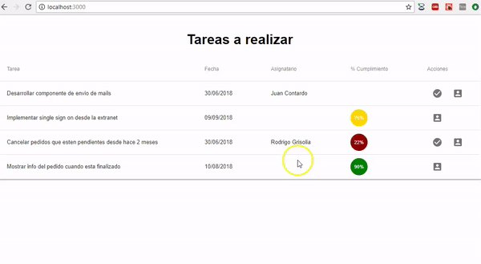
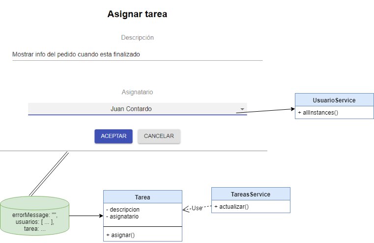

# Tareas de un equipo de desarrollo



El ejemplo que muestra las tareas de un equipo de desarrollo, permite asignar, cumplir o modificar la descripción de una tarea.

# Conceptos

- Componentes de React
- Uso de componentes visuales de Material: select (combo), text field, snack bar (message box), tablas, entre otras
- React router que define un master / detail
- Uso de fetch para disparar pedidos asincrónicos tratados con promises
- Manejo del estado

# Arquitectura general

## Página principal: ver tareas


- **TareasComponent**: es el que sabe mostrar la tabla y delega en TareaRow la visualización de cada ítem
- **TareaRow**: conoce cómo mostrar una tarea dentro de una fila de la tabla
- **PorcentajeCumplimiento**: es un componente que muestra un avatar con el % de cumplimiento en diferentes colores. En rojo se visualizan las tareas cuyo % de cumplimiento es menor a 50, luego de 50 a 90% exclusive aparecen en amarillo y por último las que tienen 90% ó más se ven en verde.


El componente llama al service quien dispara la búsqueda de tareas y devuelve la promise:

```javascript
>>TareaService
allInstances() {
  return fetch(REST_SERVER_URL + "/tareas")
}
```

Cuando el pedido vuelve con un estado ok, se actualiza el estado del componente React, transformando la lista de objetos JSON en objetos Tarea:

```javascript
>>>TareasComponent
constructor(props) {
    super(props)
    this.tareaService = new TareaService()
}

componentWillMount() {
    this.tareaService.allInstances()
    .then((res) => res.json())
    .then((tareasJson) => {
        this.setState({
            tareas: tareasJson.map((tareaJson) => Tarea.fromJson(tareaJson))
        })
    })
    .catch(this.errorHandler)
}
```

Se encadenan las promises mediante la función then, y se atrapa cualquier excepción dentro del catch.

## Cumplir una tarea

El componente captura el evento del botón:

```javascript
>>>TareaRow
<IconButton aria-label="Cumplir" onClick={(event) => this.cumplirTarea(tarea)}>
    <CheckCircleIcon />
</IconButton>
```

En ese evento se delega a cumplir de Tarea y se pide al service que actualice el backend. Cuando la promise se cumple, disparamos la actualización del estado para renderizar los cambios en la vista:

```javascript
>>>TareaRow
cumplirTarea(tarea) {
    tarea.cumplir()
    this.props.tareaService.actualizarTarea(tarea).then(
        () => this.setState({
            tarea: tarea
        })
    )
}
```

El método actualizarTarea del service dispara el método PUT:

```javascript
actualizarTarea(tarea) {
  return fetch(REST_SERVER_URL + "/tareas/" + tarea.id, {
    method: 'put',
    body: JSON.stringify(tarea.toJSON())
  })
}
```

El botón de asignación dispara la navegación de la ruta '/asignar':

```javascript
>>>TareasComponent
<IconButton aria-label="Asignar" onClick={() => this.props.history.push('/asignarTarea/' + tarea.id)}>
    <AccountBoxIcon />
</IconButton>
```

para lo cual recordemos que hay que decorar el componente TareasComponent con el router de React:

```javascript
export default withRouter(TareasComponent)
```

## Asignación de tareas



En la asignación de tareas el combo de usuarios se llena con una llamada al servicio REST que trae los usuarios:

```javascript
>>>UsuarioService
allInstances() {
  return fetch(REST_SERVER_URL + "/usuarios")
}
```

Agregamos en el combo la opción "Sin Asignar":

```javascript
<Select
    value={this.state.tarea.nombreAsignatario()}
    onChange={(event) => this.asignar(event.target.value)}
    className="formControl"
    inputProps={{
        name: 'asignatario',
        id: 'asignatario'
    }}
>
    >
        <MenuItem value=" ">
        <em>Sin Asignar</em>
    </MenuItem>
    {this.state.usuarios.map(usr => <MenuItem value={usr.nombre} key={usr.id}>{usr.nombre}</MenuItem>)}
</Select>
```

La clase formControl especifica un width más grande (el default es muy chico), en el archivo index.css:

```css
.formControl {
  width: 35rem;
  min-width: 35rem;
}
```

Para entender cómo funciona la asignación, el combo dispara el evento de cambio al componente AsignarTareas:

```javascript
... onChange={(event) => this.asignar(event.target.value)}
```

El método asignar recibe el nombre del nuevo asignatario (podríamos recibir el identificador, pero lamentablemente el servicio REST solo nos da el nombre), entonces delegamos a un método más general que actualiza el estado de la tarea:

```javascript
>>>AsignarTareaComponent
asignar(asignatario) {
    this.cambiarEstado((tarea) => tarea.asignarA(asignatario))
}

cambiarEstado(closureChange) {
    const tarea = this.state.tarea
    closureChange(tarea)
    this.setState({
        ...this.state,
        tarea: tarea,
        errorMessage: ""
    })
}
```

Al actualizar el estado se dispara el render que refleja el nuevo valor para el combo, y tenemos entonces siempre la tarea actualizada.

Cuando el usuario presiona el botón Aceptar, se dispara el evento asociado que delega la actualización al service y regresa a la página principal.

```javascript
>>>AsignarTareaComponent
asignarTarea() {
    if (this.state.tarea.nombreAsignatario().trim() === "") {
        this.generarError("Debe asignar la tarea a una persona")
        return
    }
    tareaService.actualizarTarea(this.state.tarea)
        .then(() => this.volver())
        .catch((e) => this.generarError("Error en la actualización de la tarea: " + e))
}
```

Cosas para mejorar a futuro: podríamos delegar la validación en la tarea directamente.

# Testing

Los últimos tests son básicos, validan que para el componente TareaRow al que le pasamos una tarea

- si está asignada nos aparece el botón que permite marcarla como cumplida
- si no está asignada no aparece dicho botón

```javascript
it('una tarea asignada puede cumplirse', () => {
  const tareaConstruirTest = shallow(<TareaRow tarea={construirTest} />)
  expect(tareaConstruirTest.find("#cumplir_159")).toBeTruthy()
})
it('una tarea sin asignar no puede cumplirse', () => {
  const construirTest_sinAsignar = construirTest
  construirTest_sinAsignar.desasignar()
  const tareaConstruirTest = shallow(<TareaRow tarea={construirTest_sinAsignar} />)
  expect(tareaConstruirTest.find("#cumplir_159").exists()).toBeFalsy()
})
```

Podrían aparecer más tests a futuro (como presionar el botón cumplir y ver que la tarea queda al 100%), lo dejamos a criterio del lector.

## Mockear el servicio

La parte más interesante de los tests es cómo hacemos para interceptar las llamadas **fetch** que disparan las llamadas hacia el server. Para lograr esto, primero construimos una lista de tareas con ids específicos en el test (_App.test.js_):

```javascript
function crearTarea(id, descripcion, porcentaje, asignado) {
  const result = new Tarea()
  result.id = id
  result.descripcion = descripcion
  result.porcentaje = porcentaje
  result.asignatario = new Usuario(asignado)
  return result
}

const construirTest = crearTarea(159, "Construir test TODO List", 0, "Marcos Rojo")

const mockTareas = 
  [
    crearTarea(68, "Desarrollar TODO List en React", 75, "Paula Paretto"),
    construirTest
  ]
```

Luego definimos una función que devuelve un _response mockeado_, que simula la respuesta del server, con el status http y una lista de tareas que le pasamos como parámetro: 

```javascript
const mockResponse = (status, statusText, response) => {
  return new window.Response(JSON.stringify(response), {
    status: status,
    statusText: statusText,
    headers: {
      'Accept': 'application/json',
      'Content-type': 'application/json'
    }
  })
}
```

Para evitar un inconveniente debemos escribir un hack (cosas que pasan con frameworks que todavía no alcanzaron su punto de madurez):

```javascript
// Hack para que no falle el mount del TareasComponent
// https://github.com/airbnb/enzyme/issues/1626
if (global.document) {
  document.createRange = () => ({
      setStart: () => {},
      setEnd: () => {},
      commonAncestorContainer: {
          nodeName: 'BODY',
          ownerDocument: document,
      },
  })
}
// fin hack
```

Y ahora sí podemos construir una _promise mockeada_, que decora las llamadas asincrónicas al server, pasándole el status http 200 (OK) y la lista de tareas:

```javascript
// Mock del fetch para devolver las tareas creadas en este test
const mockPromise = Promise.resolve(mockResponse(200, null, mockTareas))
window.fetch = jest.fn().mockImplementation(() => mockPromise)
```

Esto permite que el test que hace un mount del componente Tareas funcione correctamente:

```javascript
it('lista de tareas', () => {
  mount(<TareasComponent />)
})
```

Lamentablemente no pudimos lograr acceder a los valores que debe renderizar la tabla, en próximas versiones esperemos poder lograrlo, pero si el lector coloca `console.log` en TareasComponent previos al render, verá que recibe correctamente las dos tareas que creamos en el test:

```javascript
>>>TareasComponent
    componentWillMount() {
        this.tareaService.allInstances()
        .then((res) => res.json())
        .then((tareasJson) => {
            console.log("tareas", tareas) // se visualizan las dos tareas del test
            this.setState({
```

